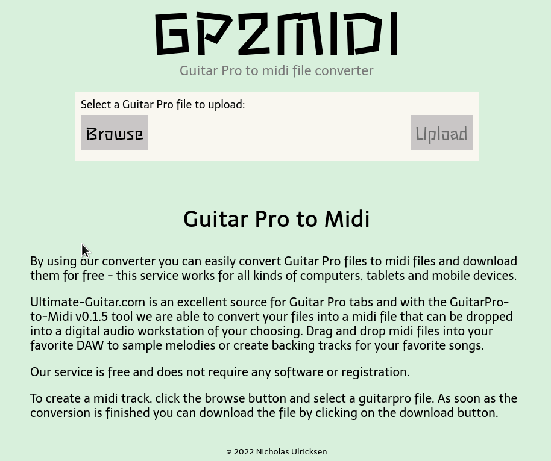

# gp2midi server

Server for gp2midi.com built with Go and Docker.

Convert Guitar Pro files to midi, useful for creating backing/jam tracks.



## Built with

- [Go](https://go.dev/)
- [Gin](https://gin-gonic.com/)
- [Docker](https://www.docker.com/)

## Installation

Go is required to run this project locally. Docker is optional.

Clone the repo:

```sh
git clone https://github.com/n-ulricksen/gp2midi-web
cd gp2midi-web
```

Install dependencies:

```sh
go install
```

## Usage

### Without Docker

To run Gin development server:

```sh
go run main.go
```

### With Docker

Build the image:

```sh
docker build -t gp2midi .
```

Run the container and Gin development server on port 8229:

```sh
docker run -p 8229:8229 gp2midi
```

## Contributing

Pull requests welcome and appreciated!

## License

[MIT](https://choosealicense.com/licenses/mit/)

